# 简易外卖平台软件 设计报告
## 171860633 徐国栋

### 引言

本次作业中，我在Qt框架下实现了一个 C/S 架构的外卖平台软件，客户端使用到 Qt::Widgets 和 Qt::Network 模块，服务器使用到 Qt::Sql 和 Qt::Network 模块。系统的应用情景是：一个服务器实例服务多个客户端实例，客户端使用了GUI界面，支持用户注册、登录；商家管理产品、处理订单；不同优惠级别的订餐者查看产品、支付订单；以及系统管理员查看销售额日志。


### 系统分析与设计

* 概述和类图

1. 客户端的行为控制集成在 MainWidget 类中，分为网络通信和 GUI 窗体展示两个部分；

2. 和服务器基本的交互模式是：在按钮控件点击行为的回调里，向服务器发送对应的任务id和当前界面表达的信息，收到服务器合法的回复后，刷新当前界面，跳转到对应的数据展示界面；

3. GUI 方面，使用建造者模式为不同用户构建不同的功能菜单，客户端的数据视图分为用户信息视图 UserForm（用户登录和注册）、产品信息视图 ProductForm 和订单信息视图 OrderForm，所有信息视图维护一个具体类的全部信息，得到提交请求的时候，收集对应的信息进行序列化并发送；

4. 考虑产品和订单具有相似的展示需求，即展示所有和编辑单个，产品信息和订单信息以子窗口行的形式罗列在带滚动条控件 QScrollArea 的 ViewWidget 类中，通过直接在列表里选中、修改对应的子窗口行来进行单项编辑。特别地，对于产品列表，通过弹出新的产品信息子窗口进行添加；对于订单列表，添加行为发生在产品列表中，订单列表（即用户的购物车、商家的订单）只维护修改状态和提交修改请求的行为。

5. 服务器单例 FoodServer 通过持有的 QTcpServer 变量处理连接请求，为每一个客户端的接入创建一个 QTcpSocket；

6. 对于 QTcpSocket 每一次接到的流数据，构造一个 ServerNetService 进行处理；

7. ServerNetService 读取流数据开头的任务id区分客户端请求，通过 DbHandlerFactory 获得 User、Product、Order 对应的 DbHandler 执行数据库的增删查改；

8. DbHandler的抽象基类封装了 QSqlQuery 提供的基于执行 sqlite 语句的数据库操作和对应调试结果打印操作；通过具体 DbHandler 中的众多 static 方法执行数据库返回值的解析任务，将解析结果标记上通信协议指定的任务id，通过 QTcpSocket 返回给客户端。

</br>
</br>

**客户端类图**

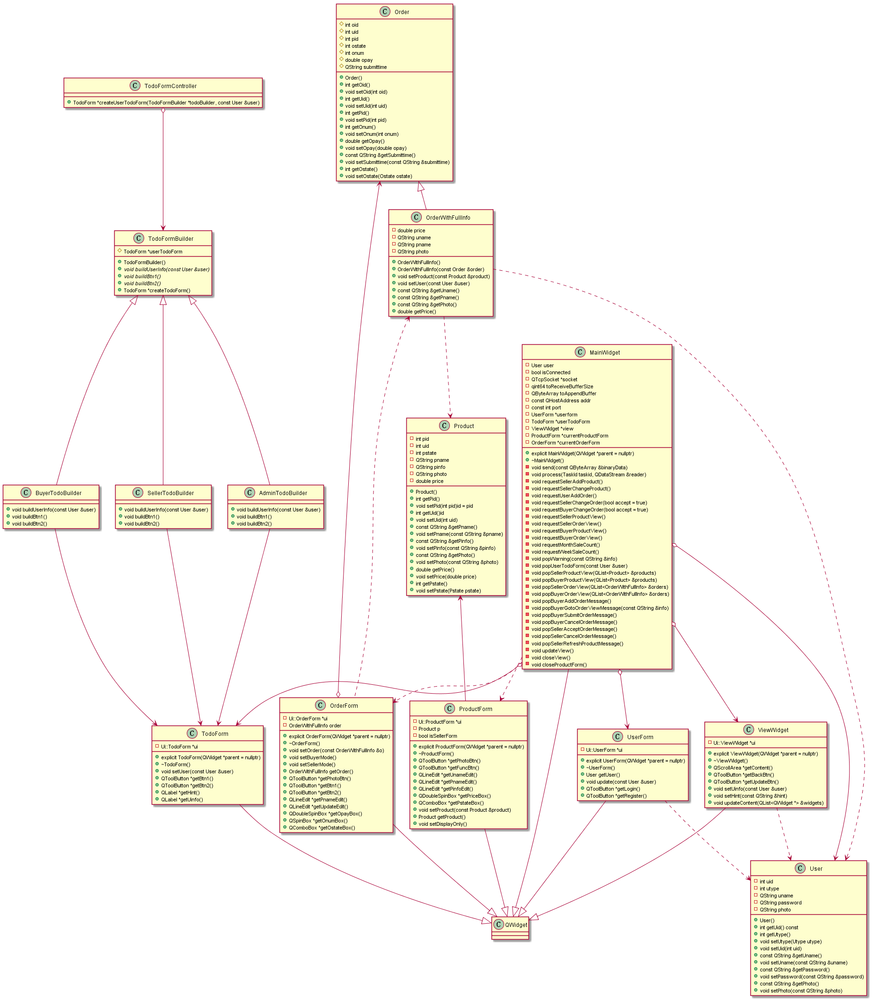

</br>
</br>
</br>
</br>

**服务器类图**

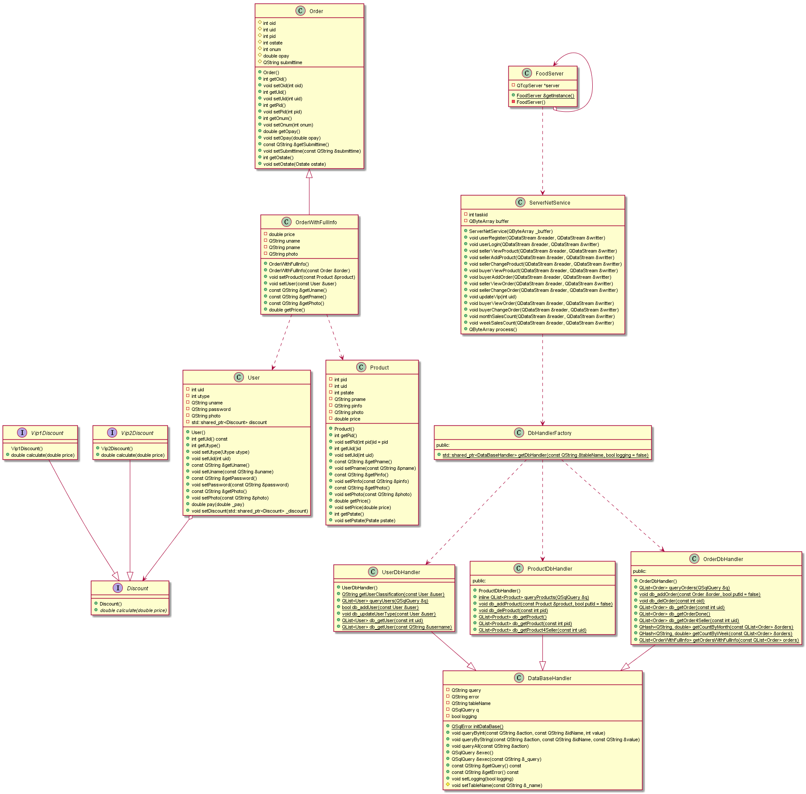

</br>
</br>
</br>
</br>
</br>

### 实现方案
#### 四个典型的设计模式
  * 服务器
   1. 单例模式
   ```cpp
   // 实现
   class FoodServer : public QObject {
   Q_OBJECT
   public:
       ~FoodServer();
       static FoodServer &getInstance();
       FoodServer(const FoodServer &) = delete;
       FoodServer &operator=(const FoodServer &) = delete;
   private:
       FoodServer();
       QTcpServer *server;
   };
   // 使用
   auto &server = FoodServer::getInstance();
   ```
   * FoodServer的监听行为在构造函数里初始化，通过 QCoreApplication::exec() 的循环机制，在下面的代码中插入实例化语句，即可做到维护一个全局的FoodServer实例。
   ```cpp
       QCoreApplication a(argc, argv);
       // insert getInstance here
       return a.exec();
   ```

   2. 简单工厂模式

   * 简单工厂模式应用在 DataBaseHandler 上，具体 DataBaseHandler 的处理数据的静态方法通过简单工厂方法，获得对应具体 DataBaseHandler 的数据库操作行为。类图如下：

   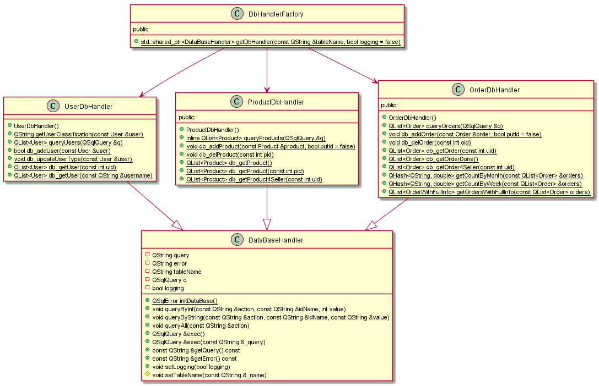

   ```cpp
   // 使用
   QString username = ...;
   auto db = DbHandlerFactory::getDbHandler("UserTable");
   db->queryByString("select", "uname", username);
   ```
   3. 策略模式

   * 策略模式被用于服务端的用户类执行结算操作上。处于安全性设计考虑，结算行为发生在Server端。类图如下：
    
   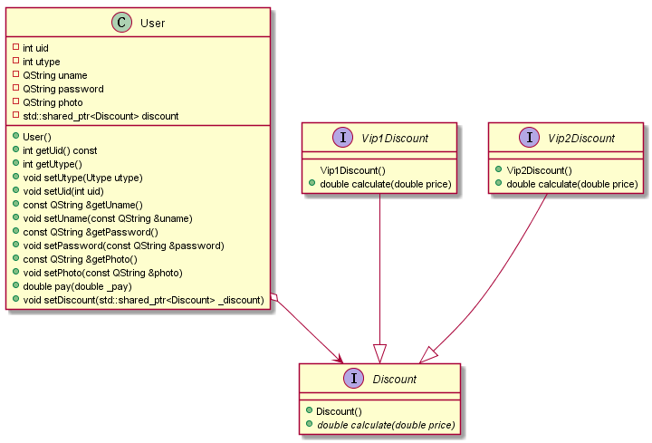

   ```cpp
   // 使用
   double User::pay(double _pay) {
        return discount->calculate(_pay);
   }
   double pay = user.pay(order.getPrice() * order.getOnum());
   order.setOpay(pay);
   ```
  * 客户端 
  4. 建造者模式
  * 建造者模式被用于功能菜单 TodoForm 的构建上，职责是为不同用户显示不同的具体功能菜单，显示不同的用户信息提示。类图如下：

    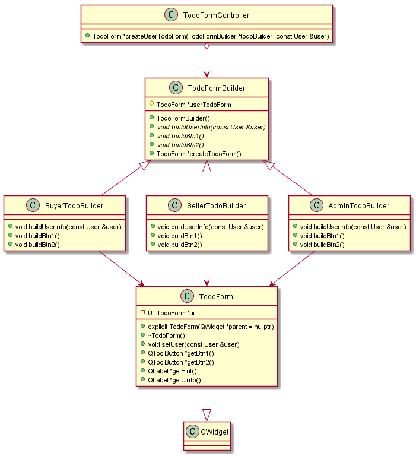

    ```cpp
    // 使用
    TodoFormBuilder *builder;
    TodoFormController controller;
    switch (user.getUtype()) {
        case seller:
            builder = new SellerTodoBuilder();
            userTodoForm = controller.createUserTodoForm(builder, user);
            ...// connect signals and slots
            break;
        case admin:
            builder = new AdminTodoBuilder();
            userTodoForm = controller.createUserTodoForm(builder, user);
            ...// connect signals and slots
            break;
        case buyer:
        case vip1:
        case vip2:
            builder = new BuyerTodoBuilder();
            userTodoForm = controller.createUserTodoForm(builder, user);
            ...// connect signals and slots
    }
    delete builder;
    ```

#### 网络通信

* Qt::Network 库封装了发送和接收tcp报文的操作，但是没有提供完整接收所有内容的接口，这意味者一个较大的序列化数据流会被拆分成多个tcp包，多次触发 QTcpSocket::readyRead 信号，导致无法一次性正确读取序列化数据。测试中发现，客户端向服务器的数据全部可以在一个tcp包中被发送，服务器返回的列表数据（比如全部订单、全部产品）大多不能在一个tcp包中被发送，所以服务端数据流需要存储长度信息，供客户端判断和拼接对应的 tcp 包中的数据。

```cpp
// 服务端发送 TCP 包
QByteArray ServerNetService::process() {
    QDataStream reader(&buffer, QIODevice::ReadOnly);
    reader >> taskid;
    QByteArray result;
    QDataStream writter(&result, QIODevice::WriteOnly);
    qint64 dataSize = 0;
    writter << dataSize;
    switch (TaskId(taskid)) {
        ...                     // 调用数据库操作
    }
    dataSize = result.size();   // 向buffer头写入buffer长度
    QDataStream _writter(&result, QIODevice::WriteOnly);
    _writter << dataSize;
    return result;
}
```
```cpp
connect(socket, &QTcpSocket::readyRead, [=]() {
    // 客户端的数据可以一次读完
    ServerNetService netio(socket->readAll());
    socket->write(netio.process());
});
```
```cpp
// 客户端接收 TCP 包，需要考虑多次读取在拼接的问题
connect(socket, &QTcpSocket::readyRead, [=]() {
    QDataStream preReader(&toAppendBuffer, QIODevice::ReadOnly);
    auto tmp = socket->readAll();
    if (toAppendBuffer.isEmpty()) { // 读第一个包
        toAppendBuffer.append(tmp);
        preReader >> toReceiveBufferSize;
        if (toAppendBuffer.size() < toReceiveBufferSize) 
            return;
    } else {                        // 读中间的tcp包
        toAppendBuffer.append(tmp);
        if (toAppendBuffer.size() < toReceiveBufferSize) 
            return;
    }// 读完一个完整的数据流，进行进一步处理
    QDataStream reader(&toAppendBuffer, QIODevice::ReadOnly);
    reader >> toReceiveBufferSize;
    int taskid;
    reader >> taskid;
    process(TaskId(taskid), reader);
    toAppendBuffer.clear();
});
```
#### 数据库操作

* 以产品表为例：
```cpp
class ProductDbHandler : public DataBaseHandler {
public:
    ProductDbHandler() { setTableName("ProductTable"); }
    static inline QList<Product> queryProducts(QSqlQuery &q);
    static void db_addProduct(const Product &product, bool putId = false);
    static void db_delProduct(const int pid);
    static QList<Product> db_getProduct();//所有产品
    static QList<Product> db_getProduct(const int pid);//指定编号的产品
    static QList<Product> db_getProduct4Seller(const int uid);//一个商家的所有产品
};
class DbHandlerFactory {
public:
    static std::shared_ptr<DataBaseHandler> getDbHandler(const QString &tableName, bool logging = false);
};
// 举一个静态成员函数的例子
void ProductDbHandler::db_delProduct(const int pid) {
    auto db = DbHandlerFactory::getDbHandler("ProductTable");
    db->queryByInt("delete", "pid", pid);
    db->exec();
}
```

* 之所以要以静态成员函数这种不够面向对象的方式编写数据库操作方法，是因为查询订单、产品列表的返回值都是 QList<具体类>，没有使用指针或智能指针来实例化模板，不方便设计出统一的抽象来处理返回值。这里只对基本的数据库语句执行方法进行了一定的抽象来简化代码。

#### 序列化和反序列化

* QDataStream 类支持通过重载 >> 和 << 操作符实现对自定义数据的序列化和反序列化，对于列表数据，QDataStream 类支持对QList<class>类型进行序列化，其中的 class 必须有>> 和 << 的具体实现。以 User 类为例：
```cpp
QDataStream &operator<<(QDataStream &s, const User &user) {
    s << user.uid << user.utype << user.uname << user.password << user.photo;
    return s;
}
QDataStream &operator>>(QDataStream &s, User &user) {
    s >> user.uid >> user.utype >> user.uname >> user.password >> user.photo;
    return s;
}
```

#### GUI控制
* GUI控制依赖Qt的信号-槽机制，类似回调函数，原理在此不赘述。总结三个触发窗口变化的情景：
1. 用户编辑文本框文本、编辑复选框、下拉菜单
2. 用户点击按钮
3. 客户端收到服务器应答

* 用户编辑输入控件的行为由 Qt 框架后台管理，只需要处理类似产品数量和总价的同步变化关系；按钮点击的响应有拉起 QMessageBox 提示和提交网络请求两种后续行为；收到服务器应答意味着按钮发送的请求得到回复，会对回复进行反序列化，将数据呈现到新的展示窗口上。

#### 销售日志
* 直接进行条件查询：
```cpp
QList<Order> OrderDbHandler::db_getOrderDone() {
    auto db = DbHandlerFactory::getDbHandler("OrderTable");
    db->queryByInt("select", "ostate", Ostate::done);// 查询完成的订单
    return OrderDbHandler::queryOrders(db->exec());
}
```
* 然后用哈希表进行计数
```cpp
QHash<QString, double> OrderDbHandler::getCountByMonth(const QList<Order> &orders) {
    QHash<QString, double> count;
    for (auto &r:orders) {  // 日期示例：周六 6月 20 09:31:45 2020
        auto split = r.getSubmittime().split(" ");
        if (count.find(split[1]) == count.end()) {
            count[split[1]] = r.getOpay();
        } else {
            count[split[1]] += r.getOpay();
        }
    }
    return count;
}
```

### 功能介绍
1. 用户注册、登录

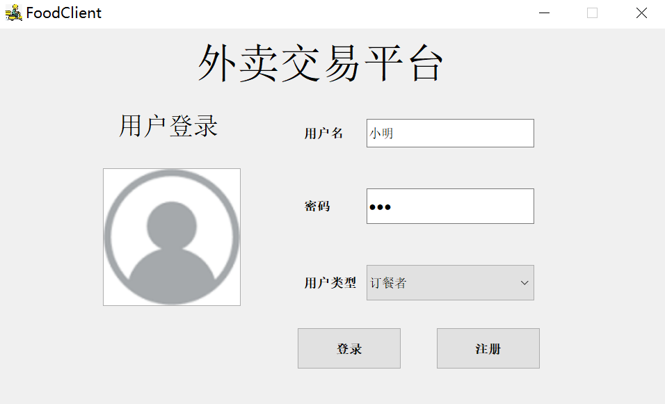

2. 商家添加产品

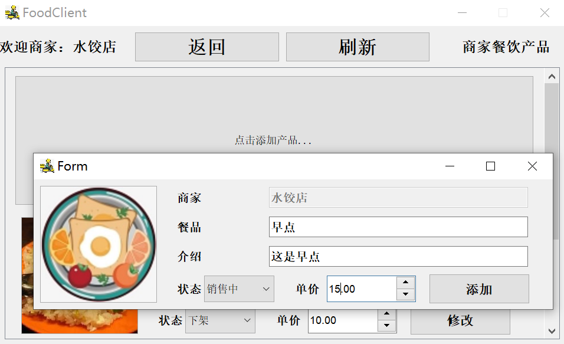

3. 商家查看和修改产品

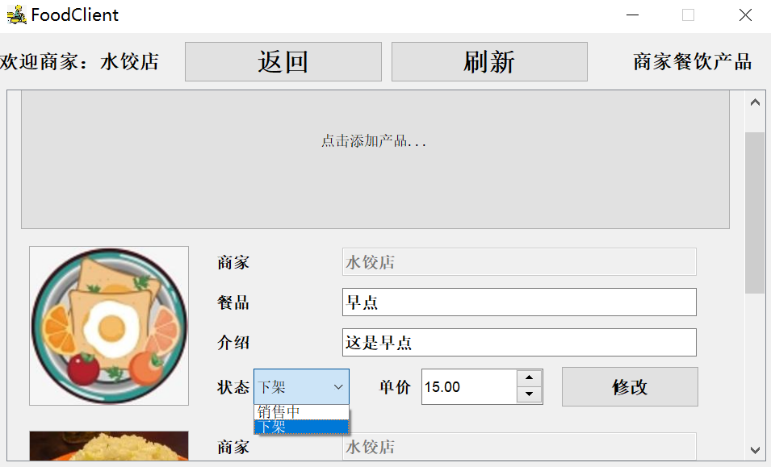

4. 商家查看和处理订单

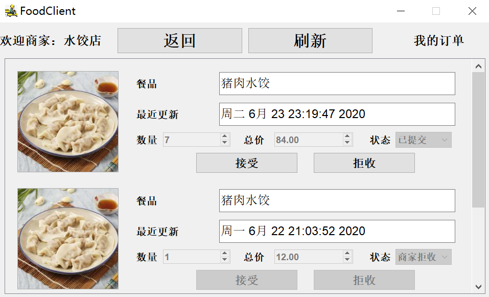

5. 订餐者查看和添加购物车

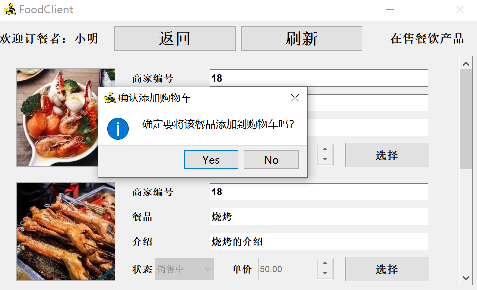
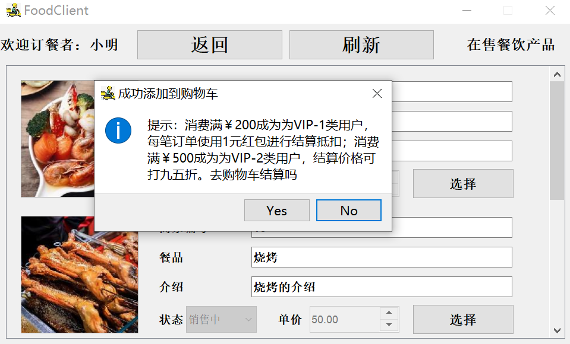

6. 订餐者查看和结算订单

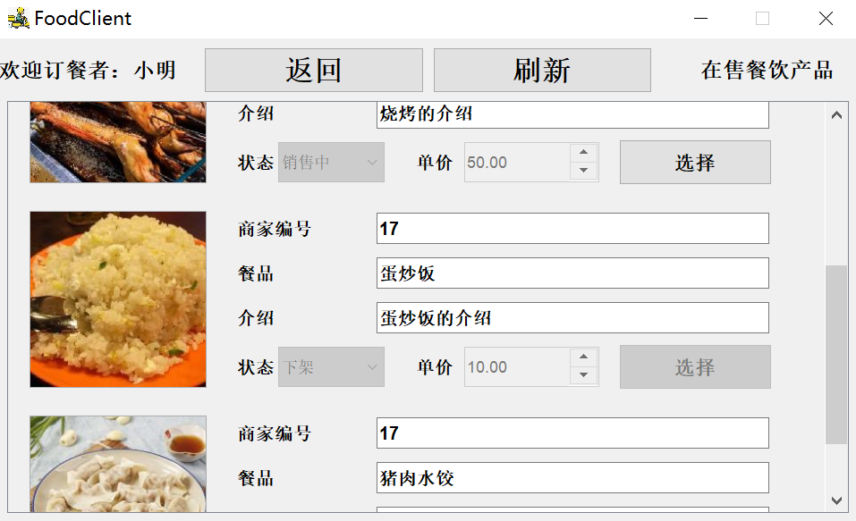
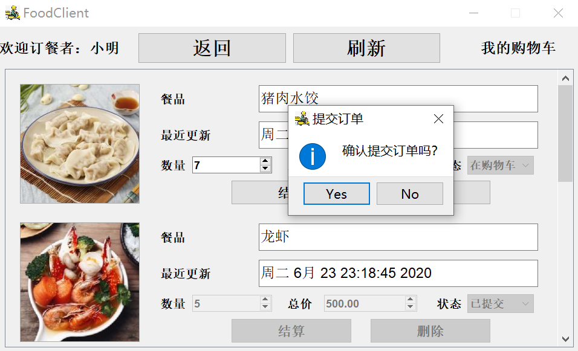

7. 订餐者优惠等级的变化

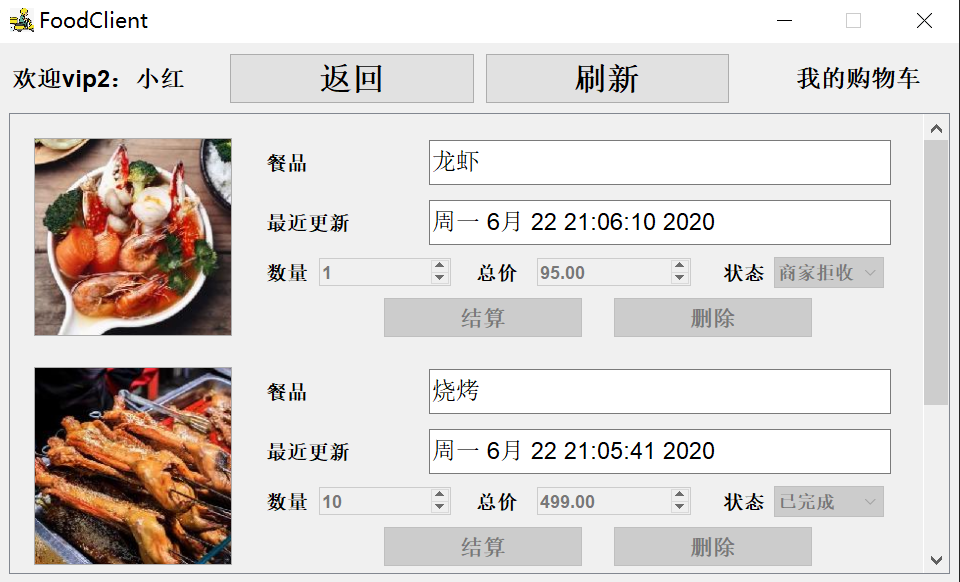

8. 管理员查询销售日志

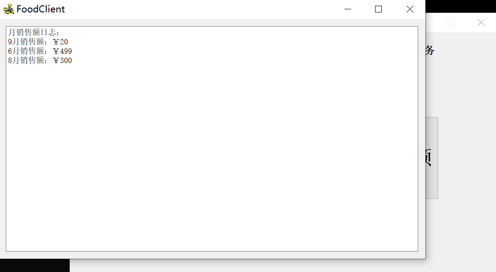

### 系统符合设计原则的情况
 * 服务器拆分出了网络通信类和数据库类，符合单一职责原则，客户端将网络通信和GUI交互整合在一起，不符合单一职责原则
 * Order类和OrderWithFullInfo类的设计符合里氏替换原则，OrderWithFullInfo类只是在Order类的基础上增加了一些成员变量和函数，继承关系没有破坏Order类原有的函数
 * FoodServer类持有QTcpServer的引用而不是继承并覆写相关方法，符合合成/聚合复用原则
  
### 小结

本次作业中实现的外卖平台软件具备 C/S 架构，支持多用户同时登陆的交互场景；实现了GUI界面；使用到了单例模式、简单工厂模式、策略模式和建造者模式；充分考虑了交互过程中的各种可能性，具有较好的鲁棒性
